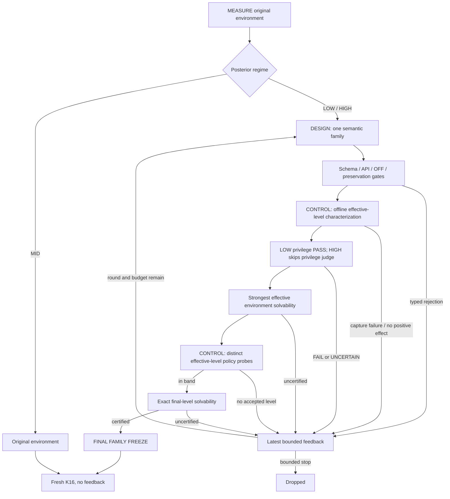

# AEA: open-ended intervention discovery and empirical control

**Method selector:** `llm_v3_designer_controller`.

This is a new method, not a repair to the historical raw-dose bracket. The historical
integrated implementation is `969e339281e71190d1df6aed579b2402513bcd45`; its E3 results are
`247ab479ff9f703db0acbb7beff11b8d73893798`. Their artifacts and scores remain historical.

## 1. Method abstraction

AEA separates open-ended intervention discovery from empirical control. The Designer
proposes semantic environment interventions. The Controller characterizes their realized
learner-facing control surfaces, calibrates among distinct effective operating points,
and returns typed empirical feedback when an intervention is useful but insufficiently
controllable. The learner is fixed throughout adaptation.

\[
\boxed{\mathrm{MEASURE}\rightarrow\mathrm{DESIGN}\leftrightarrow\mathrm{CONTROL}}
\]

- **MEASURE** estimates the current learner's original-environment success regime.
- **DESIGN** discovers what semantic change to make. It is the LLM component.
- **CONTROL** characterizes and measures how to operate a proposed change. It is a
  deterministic, stateful algorithm using real learner outcomes, not an LLM conversation.
- Structural validation, privilege screening, identity and solvability are gates.
- MID is the fixed point: return the original environment without DESIGN or CONTROL.

Three quantities must remain distinct:

| Quantity | Meaning | Evidence |
|---|---|---|
| Nominal setting | A proposed control parameter or named level | Designer declaration |
| Effective level | An equivalence class of captured learner-facing effects | Offline replay |
| Learner response | Successes and failures under the chosen rendering | Actual policy episodes |

An explicit `__DOSE__` reference proves none of controllability, monotonicity, or success.
A binary mechanism can be useful; a smooth-looking scalar can be operationally redundant.



## 2. Frozen measurement and explicit configuration

The existing estimator is reused without changing its source: prior `Beta(1,1)`, posterior
`Beta(1+s,1+f)`, regime probabilities over LOW `<.2`, MID `[.2,.8]`, HIGH `>.8`.
Start with four valid episodes, add two, and stop at posterior confidence `.9` or sixteen
valid episodes. Route by maximum posterior mass, not by thresholding the raw fraction.
There is no cross-task frontier, warm-start, or leverage memory.

Existing `AEAConfig` retains its serialized defaults and historical selector behavior.
New configuration is a separate `V3Config`, passed to `Controller` as
`designer_controller_config`; it does not insert fields into old serialized configurations.

| Setting | Default and scope |
|---|---|
| `AEAConfig.k` | 16 valid baseline episodes maximum |
| `AEAConfig.cap` | 30 adaptation policy episodes, separate from baseline |
| `AEAConfig.probe` | `(4,8)` |
| `AEAConfig.accept` | `(3,5)` out of eight |
| `V3Config.max_design_rounds` | 3, shared by LOW and HIGH |
| `V3Config.max_control_probes` | 5 distinct positive effective levels per round |
| `V3Config.scalar_grid` | `0,1/16,...,1`, seventeen nominal settings |
| Next DESIGN admission | At least eight remaining adaptation episodes by default |
| K16 learnable / target | 4–12 / 7–9 successes out of sixteen |

The eight-episode DESIGN threshold reserves one potentially acceptable probe, not a
guarantee that a family can be fully calibrated. The old sixteen-episode LOW reserve and
four-step raw-dose bracket are not invoked by this selector. A bound can end search with
unused episodes. Configured search targets can be studied later; this implementation does
not change the default target or the final K16 definitions.

## 3. Designer interface and family schema

`build_design_context(...) -> DesignContext` organizes the task, posterior measurement and
bounded baseline evidence. LOW selects up to three baseline failures and requires an
actually successful, aligned rich reference. HIGH uses representative baseline successes
and failures and rejects a supplied privileged reference. MID never builds this context.

`InterventionDesigner(complete, model, attribution, seed, ...).propose(DesignRequest)` makes
exactly one forced-tool request and returns `DesignProposal`. It does not loop, calibrate,
select a final setting or assign trusted lineage. Invalid tool/schema output becomes
mechanical feedback; provider/configuration/accounting errors propagate.

`DesignRequest` contains:

```text
context
design_round
operation
remaining_design_rounds       # includes this request
remaining_policy_rollouts
parent_family                # actual prior family, if available
feedback                     # latest typed packet only
```

The prompt has a short common discovery/control contract, a direction-specific safety
contract and the necessary Rules API. It explicitly permits binary and discrete control,
prioritizes a useful semantic mechanism, and asks refinements to retain that mechanism.
It contains no fixed intervention library or growing list of historical task examples.
Designer requests retain temperature `.7`, a 6,144-token output limit, thinking inherited from the supplied designer configuration (frozen default off), and
seed `task.seed + round - 1`; model selection remains the supplied designer configuration.

The host constructs `InterventionFamily` from the model proposal:

```text
family_id                    host-assigned task/round identity
direction                    easier | harder
mechanism_summary            private prose
source                       private Rules template
axis                         O | T | A
hooks                        declared Rules hooks
control                      ControlDeclaration
expected_effect              private proposed effect
parent_family_id             actual previous family, when present
design_round                 host-assigned
operation                    CREATE | REPAIR_CODE | REPLACE_MECHANISM | REFINE_CONTROL
semantic_mechanism_id         host-assigned lineage identity
```

`ControlDeclaration` supports:

- `BINARY`: OFF/ON, values `0,1`.
- `SCALAR`: a finite configured grid, or an explicitly declared ordered grid.
- `DISCRETE`: an explicit ordered list of numeric values with optional private level names.

The current Rules adapter uses numeric values in `[0,1]` and `__DOSE__` substitution for all
three declarations. This is an implementation encoding, not the method's definition of
control. OFF `0` and declared maximum `1` are required; a grid has 2–33 distinct ordered
settings. Scope, frequency, delay, coverage and other mechanisms remain open-ended source
implementations, not a hand-authored knob library.

## 4. Effective-level characterization

`ActuatorCharacterizer.characterize(family, task_id, episodes)` runs candidate hooks on
fixed original replay prefixes without invoking a learner or designer model. The same
suite is retained across design rounds: selected original LOW failures or representative
HIGH successes/failures. Reference prefixes are not inserted into the learner's evidence.

For each nominal setting and episode/step, it captures the actual learner-facing delta:

- formatted observation, observation text and visible history;
- admissible action content and order;
- proposed/filtered actions and blocking feedback;
- interaction stopping flags, including HIGH truncation;
- transition feedback as exposed in the observation/history channels.

Raw simulator state, audit-only reward and arbitrary `info` are not a measure of intensity.
Raw transition fields remain available to the preservation gate. The historical surface
field `final_prompt` is formatted observation plus separately recorded history, not a
byte-for-byte capture of the full API chat request.

Let `C` denote the fixed captured prefixes and `Delta(u,c)` the exact visible change:

\[
u_i\sim_C u_j\quad\Longleftrightarrow\quad
\forall c\in C:\ \Delta(u_i,c)=\Delta(u_j,c).
\]

Signatures hash canonical JSON of episode/step deltas, preserving list order and JSON
types. Nominal dose, source hash and hidden-state fields do not enter that equivalence.
Source, declaration, coverage and raw-evidence hashes are separately bound to the complete
characterization. `as_record()` is an audit representation, not a publication boundary:
its task/family/episode identities and coverage must pass the strict public projection. Missing, duplicated, conflicting or errored captures cannot pass as
complete characterization. OFF must be identical both in shared mechanical smoke and in
the actual captured suite, for both directions.

`EffectiveControlLevel` records:

```text
level_id                     surface-signature-derived ID
surface_signature
settings / equivalent_settings
representative               last setting in its proposed order
order                        order of last occurrence
is_off
rendered_source_sha256
coverage
```

Settings equivalent to OFF are not positive levels. Nonconsecutive recurrence such as
`A -> B -> A` records `NON_MONOTONE_CONTROL_SURFACE`. It does not invent an intensity scale,
reject a useful discrete family, or infer direction from stochastic successes.

**Scope:** this is equivalence on the captured suite, not global program or behavioral
equivalence. Divergent/remapped/blocked histories that the existing replay adapter cannot
continue safely produce an explicit capture failure. The method does not manufacture
unseen history or certify all future candidate-induced paths.

## 5. Empirical Controller

`EnvironmentController(config, control_config).calibrate(family, characterization,
run=..., remaining=...) -> ControllerDecision` is the shared algorithm for both directions.
It receives a policy-batch callback and budget reader; it has no LLM interface.

Its frozen search order is:

1. Probe the last positive level in the proposed order (the proposed strongest effect).
2. If it overshoots, probe the first positive level (the proposed weakest).
3. Visit the midpoint of the largest remaining untested **ordinal gap**; resolve ties
   deterministically toward the lower gap.
4. Stop on acceptance, exhausted distinct levels, the configured five-level bound, or an
   unaffordable batch. No interval is discarded on a mathematical monotonicity assumption.

Each effective level is policy-probed at most once per provisional family. The permitted
4-to-8 top-up is part of that same probe. Equivalent nominal aliases are not separate
experiments; a mocked `4/4` versus `0/4` at two aliases cannot become direction evidence.
Characterization is family/suite scoped; a redesigned source must be characterized and
admitted anew, and its policy evidence is not silently inherited from a different family.

Evaluation reuses the existing rule: `0/4` is too hard, `4/4` too easy; otherwise request
four additional episodes, accept only `3–5/8`. An unaffordable top-up leaves a recorded
incomplete probe, never an accepted `2/4`. Actual episode IDs, successes, counts, verdicts,
remaining budget, equivalence classes and diagnostics stay in the session record.

The first proposed strongest level still on the baseline side returns `NO_LEVERAGE`.
An in-band binary ON level is accepted immediately. A declared binary ON overshoot returns
`OVERPOWERED_BINARY`. A scalar/discrete declaration whose settings collapse to one positive
overshooting effect returns `INSUFFICIENT_ATTENUATION`. If all available distinct levels
have been measured and lie on both sides of the target, return `INSUFFICIENT_RESOLUTION`.
Unvisited distinct levels after a bound produce `CONTROL_EXHAUSTED`.

## 6. Typed feedback and bounded redesign

| Reason | Next operation, if another round is affordable |
|---|---|
| `ACCEPTED` | No further DESIGN after final certification/freezing |
| `MECHANICAL_FAILURE` | `REPAIR_CODE` |
| `PRIVILEGE_REJECTION` | `REPLACE_MECHANISM`, LOW only |
| `SOLVABILITY_FAILURE` | `REPLACE_MECHANISM` |
| `NO_LEVERAGE` | `REPLACE_MECHANISM` |
| `OVERPOWERED_BINARY` | `REFINE_CONTROL` |
| `INSUFFICIENT_ATTENUATION` | `REFINE_CONTROL` |
| `INSUFFICIENT_RESOLUTION` | `REFINE_CONTROL` |
| `NON_MONOTONE_CONTROL_SURFACE` | Recorded diagnostic; refinement operation if used as feedback |
| `CONTROL_EXHAUSTED` | `REFINE_CONTROL` |

`ControllerFeedback` binds reason, operation, family, source, semantic lineage, round,
measured probes, characterization counts, diagnostics and remaining rollout budget.
Gate explanations and judge revision reasons remain private. Numerical outcomes are
empirical evidence, not a model's prediction of efficacy.

`REFINE_CONTROL` and `REPAIR_CODE` retain the parent semantic-mechanism ID and require the
declared mechanism summary to remain verbatim. `REPLACE_MECHANISM` assigns a new semantic
ID with an explicit parent family link. A rejected changed-summary refinement cannot
replace the prior semantic anchor. This enforces declared lineage, not a proof that
arbitrary generated programs have identical semantics.

Both directions use the same `DesignSession`, with a default maximum of three DESIGN rounds
(configurable), exactly one family per call, original bounded evidence and only the latest
feedback packet.
Invalid proposals consume a design round. No cross-task memory or unbounded conversation
is introduced.

## 7. Gates and source/level binding

Each proposal passes shared source/schema/API validation, task preservation and OFF
identity before offline characterization. LOW additionally retains its lexical check.

LOW uses the existing R5 `WitnessCheckingPrivilegeJudge`, unchanged model/prompt/schema and
witness logic. Every declared finite control setting enters the source/surface evidence.
Only PASS admits. FAIL and UNCERTAIN both reject safely with typed redesign feedback.
The historical R5 Phase-A readiness remains `NOT_READY`; this task does not optimize it.

Admission binds task, complete family identity, template, declaration, V3 configuration,
characterization, raw input and every representative rendering. Each LOW policy dispatch
checks the exact effective level and rendered candidate. A REFINE_CONTROL child or newly
introduced setting cannot reuse its parent's PASS. Before K16, saved R5 inputs/responses
and witness anchors are verified offline again.

HIGH receives no privileged reference and skips the LOW privilege judge. Its challenge
contract preserves task/world/reward/success; truncation-only horizon changes remain
permitted. LOW preserves termination too. Both have mechanical OFF identity and captured
transition-preservation checks. These remain bounded checks, not formal program proofs.

## 8. Solvability and final freeze

The strongest positive representative is certified before Controller policy probes.
LOW uses the existing oracle-only guard; HIGH first replays its shortest baseline success,
then uses the oracle. The configured expert bound remains three attempts of fifty steps.
Self-certification and unresolved infrastructure errors cannot silently pass.

If CONTROL selects a different rendered environment, certify that exact environment
before output. Successful certificates are reused only for byte-identical rendered
source/actions, not merely equal captured surface signatures. Ordinary uncertified results
return `SOLVABILITY_FAILURE`; infrastructure failures stop.

After initial gates and certification the family is **PROVISIONAL**. The final boundary is:

```text
Controller in-band level -> exact final solvability -> FINAL FAMILY FREEZE
```

Freeze binds family, declaration, characterization, chosen level, rendered source,
admission and certification. Only then write the final corpus environment and end DESIGN.
This intentionally changes the historical freeze-on-first-leverage rule.

## 9. Confirmation, accounting and artifacts

`designer_controller_confirmation.confirm(host, task)` accepts only a terminal accepted or
kept task. It reconstructs and checks the saved final environment and LOW admission, then
performs exactly four fresh batches of four. Search IDs cannot be reused, task/seed/source
must match, and the method-state hash must remain unchanged after every batch. K16 has no
DESIGN/CONTROL callback. Errors leave a partial confirmation; implicit retries/replacements
are refused. Dropped tasks do not receive K16. A previously started v3 task is rejected
before any new baseline measurement; empty in-memory budgets cannot authorize an implicit restart.

Baseline and adaptation remain separately charged before dispatch; errors remain recorded
and valid-episode refunds do not erase API costs. Characterization/expert replay consumes
no paid learner-rollout budget. Designer/judge calls, confirmation and every physical API
attempt retain their own attribution. The new audited substrate reuses existing physical
transport/policy accounting rather than the historical E3 launcher's global run directory.

Private per-task records include request/response evidence, proposal/lineage, raw surface
captures, explicit gate rejections and privilege verdicts, certificates, provisional families,
control history and terminal freeze. Mechanical PASS is implied by progression through the
gated session; it is not a separate per-check receipt. Generated source, reference material, surfaces, raw prompts and free-form judge
feedback remain local/gitignored. Public projections reconstruct only approved enums,
counts, numeric settings and hashes; they do not copy arbitrary model prose.

## 10. Legacy preservation and validation scope

The new selector is explicitly dispatched before historical LOW/HIGH branches. Existing
`bracket.py`, `rules_control.py`, measurement, R5 judge/witness and old optimizer modules
remain unchanged. Shared plumbing recognizes the new selector for task-local measurement
and accounting, while each old selector retains its previous condition values and behavior.

Validation comprises synthetic equivalence/control regressions, shared-session and gate
integration, independent K16 isolation checks, the complete unit suite, and real ALFWorld
offline capture. Historical E3 families 8/9/10/17/23 are characterized from saved evidence
or local replay solely for engineering diagnosis. No retrospective score is changed, and
unobserved policy outcomes are never invented to complete a counterfactual control trace.

This task does not launch paid E3. Efficacy, alternative target bands and matched-budget
comparisons require a later reviewed experiment. No learner training, population search,
cross-task memory, fixed intervention library or judge optimization is part of this method.

## 11. Implementation map

| Module | Responsibility |
|---|---|
| `intervention.py` | Family/control schema, settings, new configuration, typed vocabulary |
| `actuator.py` | Offline surface equivalence, coverage, representative levels |
| `intervention_designer.py` | Shared concise LLM contract, evidence and one-proposal interface |
| `intervention_gates.py` | Shared mechanical gates and exact LOW R5 admission |
| `intervention_control.py` | Deterministic distinct-level calibration and feedback |
| `design_session.py` | Bounded shared LOW/HIGH loop, lineage, certificates, final freeze |
| `designer_controller_confirmation.py` | Saved final verification and isolated fresh K16 |
| `designer_controller_substrate.py` | Existing runtime with private physical API auditing |
| `designer_controller_artifacts.py` | Validated task records and strict public metadata |

The public integration entry remains `Controller(AEAConfig(method_version=
"llm_v3_designer_controller"), substrate, ..., designer_controller_config=V3Config())`.
Use the new audited substrate for production accounting and its lazy reference provider;
the method itself does not choose or launch an experiment cohort.
